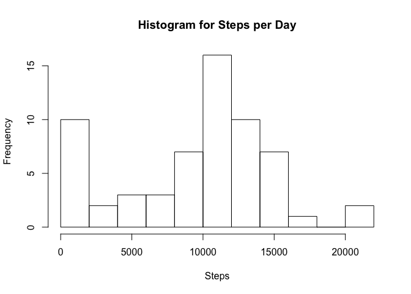
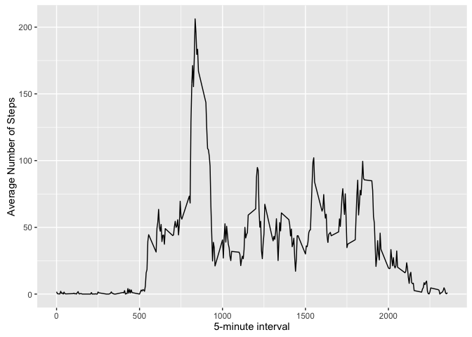
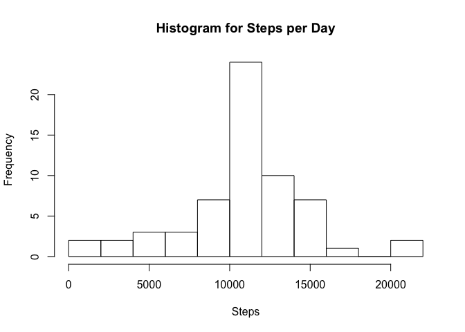
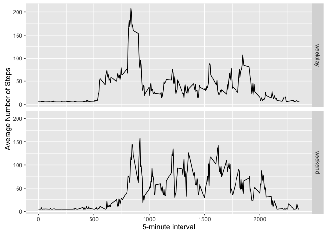

RepProject1
================
Erich Petushek
8/17/2017

The variables included in this dataset are:

steps: Number of steps taking in a 5-minute interval (missing values are coded as 𝙽𝙰) date: The date on which the measurement was taken in YYYY-MM-DD format interval: Identifier for the 5-minute interval in which measurement was taken The dataset is stored in a comma-separated-value (CSV) file and there are a total of 17,568 observations in this dataset.

Code for reading in the dataset and/or processing the data
----------------------------------------------------------

### Histogram of the total number of steps taken each day

``` r
d <- dir()
data <-read.csv(d[1])
data$steps <- as.numeric(data$steps)
total.steps <- tapply(data$steps, data$date, FUN = sum, na.rm = TRUE)
hist(total.steps, main= "Histogram for Steps per Day", xlab="Steps", breaks = 10)
```



### Mean and median number of steps taken each day

``` r
mean(total.steps, na.rm = TRUE)
```

    ## [1] 9354.23

``` r
median(total.steps, na.rm = TRUE)
```

    ## [1] 10395

### Time series plot of the average number of steps taken

``` r
library(ggplot2)
averages <- aggregate(x = list(steps = data$steps), by = list(interval = data$interval), 
    FUN = mean, na.rm = TRUE)
ggplot(data = averages, aes(x = interval, y = steps)) + geom_line() + xlab("5-minute interval") + 
    ylab("Average Number of Steps")
```



### The 5-minute interval that, on average, contains the maximum number of steps

``` r
maxInterval <- averages$interval[which.max(averages$steps)]
maxInterval
```

    ## [1] 835

Code to describe and show a strategy for imputing missing data
--------------------------------------------------------------

### Calculate and report the total number of missing values in the dataset

``` r
sum(is.na(data$steps)) 
```

    ## [1] 2304

### Filling in missing data with average accross all days

``` r
newdata <- data
newdata$steps[is.na(newdata$steps)] = mean(newdata$steps, na.rm=TRUE)
```

### Histogram of the total number of steps taken each day

``` r
total.steps2 <- tapply(newdata$steps, newdata$date, FUN = sum, na.rm = TRUE)
hist(total.steps2, main= "Histogram for Steps per Day", xlab="Steps", breaks = 10)
```



### Mean and median number of steps taken each day

``` r
mean(total.steps2, na.rm = TRUE)
```

    ## [1] 10766.19

``` r
median(total.steps2, na.rm = TRUE)
```

    ## [1] 10766.19

### Mean and median number of steps taken each day

``` r
meandiff <- mean(total.steps2, na.rm = TRUE) - mean(total.steps, na.rm = TRUE)
meddiff <- median(total.steps2, na.rm = TRUE)- median(total.steps, na.rm = TRUE)
meandiff
```

    ## [1] 1411.959

``` r
meddiff
```

    ## [1] 371.1887

Are there differences in activity patterns between weekdays and weekends?
-------------------------------------------------------------------------

### Create a new factor variable in the dataset with two levels – “weekday” and “weekend” indicating whether a given date is a weekday or weekend day.

``` r
library(plyr)
newdata <- transform(newdata, date=as.Date(date));
newdata$dow <- weekdays(newdata$date);

isweekend <- weekdays(newdata$date) == "Saturday" | weekdays(newdata$date) == "Sunday"
newdata$daytype <- factor(isweekend, labels=c('weekday','weekend'))

meanstepsbyinterval <- ddply(newdata, .(interval, daytype), summarise, meansteps = mean(steps, na.rm = T))

ggplot(data = meanstepsbyinterval, aes(x = interval, y = meansteps)) + geom_line() + xlab("5-minute interval") + 
    ylab("Average Number of Steps") + facet_grid(daytype ~ .)
```


